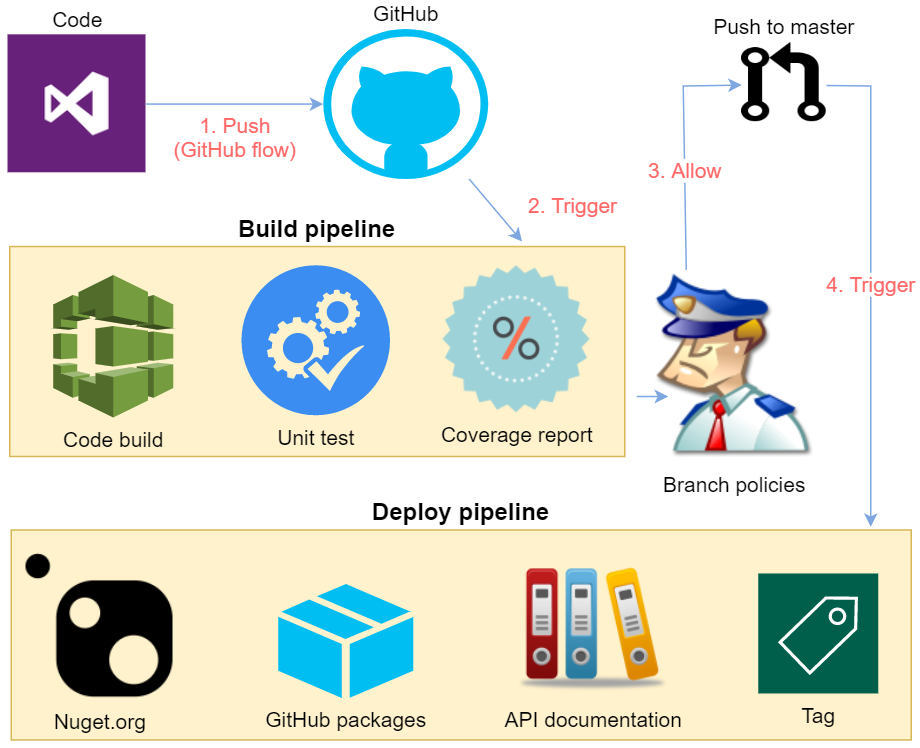

<div align="center" markdown="1">


# .NET Core Utility Library

[](https://github.com/celerik/celerik-netcore-util/actions?query=workflow%3Abuild)
[](https://github.com/celerik/celerik-netcore-util/actions?query=workflow%3Adeploy)
[](https://github.com/celerik/celerik-netcore-util/actions?query=workflow%3Adocumentation)
[](https://coveralls.io/github/celerik/celerik-netcore-util)
[](http://www.nuget.org/packages/Celerik.NetCore.Util/)

</div>

## What's it

*Celerik.NetCore.Util* provides some custom utilities for .NET Core projects, including: attributes, azure, datetime, exceptions, files, json, pagination, resources, testing, convertions, crypto, enums, queries, stack trace, strings, validations.

## Quick start

```
PM > Install-Package Celerik.NetCore.Util
```

## API and examples

 - Check out API's documentation [here](https://celerik.github.io/celerik-netcore-util/api/Celerik.NetCore.Util.html).
 - Check out tutorials on Celerik's blog [here](http://celerik.com).
 
## Requirements
  - .NET Standard 2.0
  
## CI/CD pipeline

<div align="center">
    
</div>

## What's next

Check out the road map of *Celerik.NetCore.Util* [here](ROADMAP.md).

## License

*Celerik.NetCore.Util* is licensed under the [MIT license](LICENSE).

## How to contribute
Check out the contributing guide [here](CONTRIBUTING.md).
